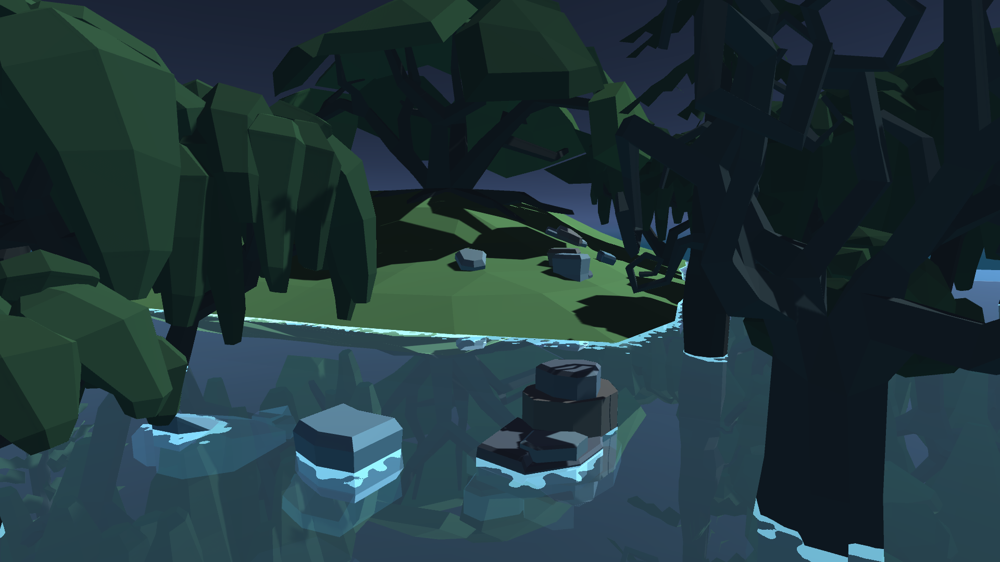

# Planar Reflections for Unity's Built-In Render Pipeline

This project is a small demo and the code for a planar reflections probe, easy to incorporate into any project. Feel free to use it on your own games or to study and and learn from it! The main file you're looking for is [this](source/Assets/Scripts/PlanarReflectionsProbe.cs) one if you want to see how I made my implementation. Feel free to optimize, adapt it to your projects or use it as is.

# Instructions

Just add the [this](source/Assets/Scripts/PlanarReflectionsProbe.cs) C# script file and [this](source/Assets/Shaders/PlanarReflections.cginc) shader include file to your project. After that, go to the editor and you can add the Planar Reflections Probe component to any game object in the scene, just click Add Component > Rendering > Planar Reflections Probe.

In order to render them somewhere, you need to write your own shader, include the .cginc file in it, enable the _PLANAR_REFLECTIONS_ENABLED keyword and any one of the _PRID_ONE, _PRID_TWO, etc keywords, depending on what you set the probe's target ID number. You can see the [water shader](source/Assets/Shaders/Water.shader) I wrote as an example.

# Credits

All code, the water and its material by [Rafael Bordoni](https://github.com/eldskald). All 3D models by [Broken Vector](https://assetstore.unity.com/publishers/12124).
