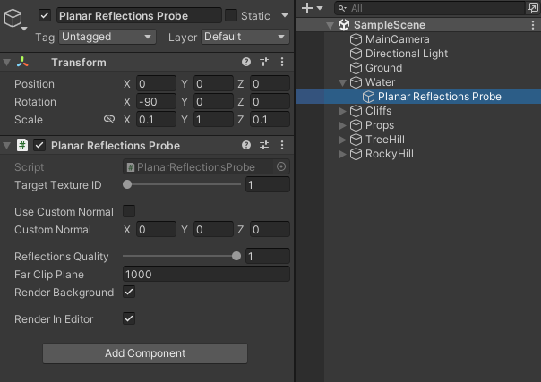

# Planar Reflections for Unity's Built-In Render Pipeline

This project is a small demo and the code for a planar reflections probe, easy to incorporate into any project. Feel free to use it on your own games or to study and and learn from it! The main file you're looking for is [this](src/built-in/PlanarReflectionsProbe.cs) one if you want to see how I made my implementation. Feel free to optimize, adapt it to your projects or use it as is.

# Instructions

Just add the [this](src/built-in/PlanarReflectionsProbe.cs) C# script file and [this](src/built-in/PlanarReflections.cginc) shader include file to your project. After that, go to the editor and you can add the Planar Reflections Probe component to any game object in the scene, just click Add Component > Rendering > Planar Reflections Probe.

In order to render them somewhere, you need to write your own shader, include the .cginc file in it and enable one of the _PRID_ONE, _PRID_TWO, etc keywords depending on what you set the probe's target ID number. You can see the [water shader](source/Assets/Shaders/Water.shader) I wrote as an example, using a KeywordEnum tag and multi-compile for and easy implementation. Read the comments on the shader files for more information.

Lastly, I made [this](https://youtu.be/w84-l3IEhXM) YouTube video to explain how planar reflections work. With the knowledge in there, you can reproduce this probe into any project in any other engine, probably.

# Documentation

This is how a planar reflections probe looks like in the inspector:

All you need to do is put the component in a game object and position it in the reflective plane, with the forward vector (the blue one in the transform widget) pointing away from the plane. In the sample scene, I put it in the water so whenever I move or rotate the water, the reflections remain correct. Pay attention to the rotation, as the probe's blue vector must be perpendicular to the water.

## Properties

| Type | Property | Description |
|:----:|:---------|:------------|
| *int* | targetTextureID | Which texture slot this probe will render to. There are four slots, in case you want to have multiple reflective surfaces on the scene, make multiple probes and make each one render to a different ID. Be aware that each probe is a render call from a camera, so it can be quite GPU intensive |
| *bool* | useCustomNormal | When turned on, you set the reflective plane's normal vector to whatever you want. When off, it's set to the transform's forward vector. |
| *Vector3* | customNormal | The normal direction of the reflective plane if you turn on useCustomNormal |
| *float* | reflectionsQuality | The resolution of the texture this probe will render to. This float will multiply the current camera this probe is rendering to, so if you're rendering a 1080p screen and set the probe to 0.5, the reflections texture will be 540p. |
| *float* | farClipPlane | The far value of the camera this probe will spawn in order to render the reflections. |
| *bool* | renderBackground | If turned on, will use whatever settings and custom skyboxes on the camera this probe is rendering to. Otherwise, background will have an alpha value of zero on the rendered texture. |
| *bool* | renderInEditor | Allows this probe to render in the editor. |

## Public Methods

| Type | Method | Description |
|:----:|:-------|:------------|
| *void* | IgnoreCamera (Camera cam) | By default, the probe will render reflections for every render call from any camera. If you want it not to render for a specific camera, use this method with *cam* as the camera you want it to ignore. |
| *void* | UnignoreCamera (Camera cam) | Each time you use the IgnoreCamera method, the camera is sent to an internal list of ignored cameras. Use this method to remove the camera *cam* from this list and start rendering reflections to it again. |
| *bool* | IsIgnoring (Camera cam) | Returns true if *cam* is on the ignored list, false otherwise. |
| *void* | ClearIgnoredList () | Empties the ignored list. |

## Static Methods

| Type | Method | Description |
|:----:|:-------|:------------|
| *PlanarReflectionsProbe* | FindProbeRenderingTo (int id) | Returns the first PlanarReflectionsProbe object found on the scene that's rendering to target ID *id*. |
| *PlanarReflectionsProbe[]* | FindProbesRenderingTo (int id) | Returns an array of all PlanarReflectionsProbe objects on the scene that are rendering to target ID *id*. |

# Changelog

- **Jan 23, 2023**   Remove planePosition, now using the game object's transform's position instead. Renamed useForwardAsNormal for useCustomNormal and renamed planeNormal to customNormal.

- **Jan 25, 2022**   Initial release.

# Credits

All code, the water and its material by [Rafael Bordoni](https://github.com/eldskald). All 3D models by [Broken Vector](https://assetstore.unity.com/publishers/12124).
